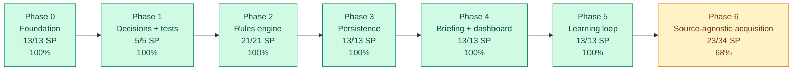

# Status

Last updated: 2026-05-13

## Current State

- Version 0.2.0 is prepared as a minor release candidate.
- Repository contains an early Python package under `src/reddit_radar/`.
- Product direction is described in `README.md`.
- Existing docs cover architecture notes, adaptive learning, and ChatGPT/Codex review workflow.
- Collector has a dry-run fixture mode and a PRAW-backed live Reddit adapter boundary.
- ADR 0007 is accepted: Reddit is one source family behind a source-agnostic acquisition layer.
- The first source registry, canonical source item model, generic RSS adapter, and RSS command path
  are implemented.
- The assessment pipeline can process collected items and persist reviewable records.
- The briefing generator reads stored assessments.
- The dashboard has data-backed queue sections and decision controls.
- The classifier has initial rules for the regression examples.
- The scorer has initial explainable score breakdowns for the regression examples.
- The SQLite store can persist assessed opportunities and human decisions.
- The SQLite store deduplicates repeated Reddit items into the existing assessment.
- The learning loop can record missed opportunities, source candidates, and learning events.
- Weekly learning reports can summarize false positives, misses, source candidates, and learning events.
- SQLModel entities exist for Reddit items, assessments, missed opportunities, source candidates, and learning events.
- `Makefile` has `check`, `lint`, `coverage`, `test`, `briefing`, `learning-report`, `dry-run`,
  and `codex-context` targets.
- Commits run Python linting, Markdown linting, and 96% minimum Python coverage through
  `.githooks/pre-commit`.

## Current Documentation Work

- `.codex/` project memory has been initialized.
- `CHANGELOG.md` has been initialized.
- `Docs/architecture.md` has been expanded into the architecture reference.
- `Docs/source_acquisition.md` documents the proposed source-agnostic acquisition design.
- `Docs/adr/` has been initialized for decision records.
- `Docs/adr/0007-source-agnostic-acquisition.md` records the accepted swappable adapter decision.
- `TODO.md` has been initialized with the next architecture and implementation work.
- `make codex-context` now includes the `.codex/` memory, architecture docs, and changelog.

## Known Gaps

- The pipeline still stores assessed items through the existing compatibility table; deeper storage
  renaming from Reddit item to source item is pending.
- Live Reddit collection has not been exercised against the real API yet because
  `REDDIT_CLIENT_ID` and `REDDIT_CLIENT_SECRET` are not configured.
- Visual Streamlit dashboard verification is still pending.
- Hacker News and Lobsters adapters are still pending.
- Tests validate regression examples, dry-run and RSS pipeline paths, storage, dashboard sections,
  briefing generation, learning reports, and the quality gate.
- Product workflow details still need tuning as implementation proceeds.

## Phase Plan and Progress

Story points are relative size estimates. Time estimates are rough working-time ranges based on the limited project history so far: one scaffold release has been completed, but there is not enough historical data for a reliable long-term velocity. For planning, assume about 8-12 story points per focused working day until real implementation velocity is measured.

| Phase | Scope | Estimate | Progress | Remaining Time |
| --- | --- | ---: | ---: | --- |
| Phase 0 | Foundation and project memory | 13 SP | 100% | Done |
| Phase 1 | Architecture decisions and test harness | 5 SP | 100% | Done |
| Phase 2 | Rules-first opportunity engine | 21 SP | 100% | Done |
| Phase 3 | Persistence and human decisions | 13 SP | 100% | Done |
| Phase 4 | Briefing and dashboard MVP | 13 SP | 100% | Done |
| Phase 5 | Learning loop and source quality | 13 SP | 100% | Done |
| Phase 6 | Source-agnostic acquisition and operational hardening | 34 SP | 68% | 0.75-1.5 days plus Reddit API credentials |

Total MVP estimate: 112 SP.

Current completed credit: 101 SP, counting Phases 0-5 plus completed Phase 6 dry-run work,
bounded live-run command, source registry, generic RSS adapter, and the operational quality gate.

Overall MVP progress: about 90%.

```text
MVP progress
[##################--] 90%
```



## Next Useful Work

1. Add Hacker News and Lobsters adapters as non-Reddit proof points.
2. Add source-level health reporting and backoff for failed feeds.
3. Decide whether the compatibility storage table should be renamed from Reddit item to source item
   before more adapters are added.
4. Keep the approved Reddit API smoke test queued for when credentials arrive.
5. Visually verify the Streamlit dashboard with the dry-run database.

## Recommended Next Step

Add Hacker News and Lobsters adapters next. This is the best move because it proves the
source-agnostic design with non-Reddit sources before spending more effort on Reddit-specific
fallbacks.
