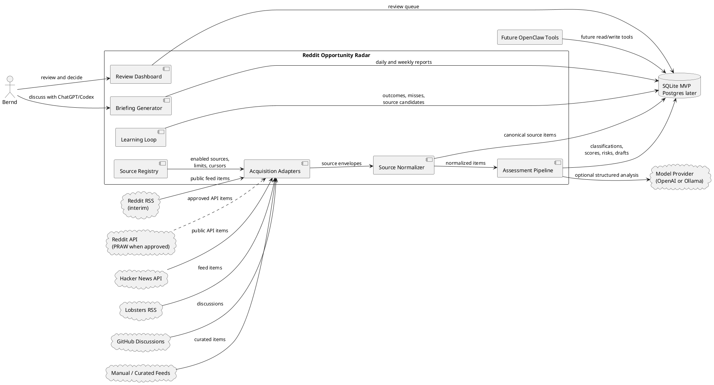
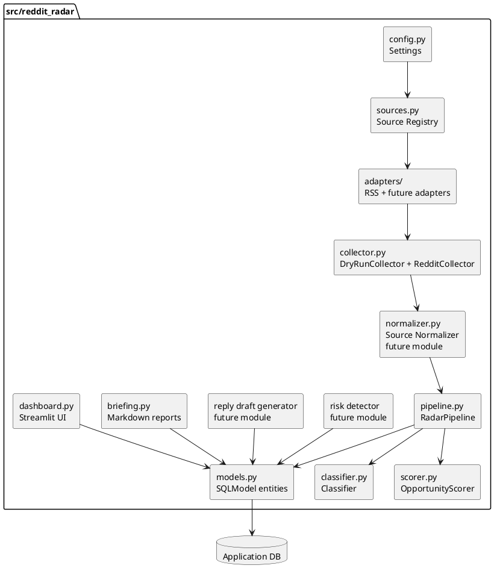
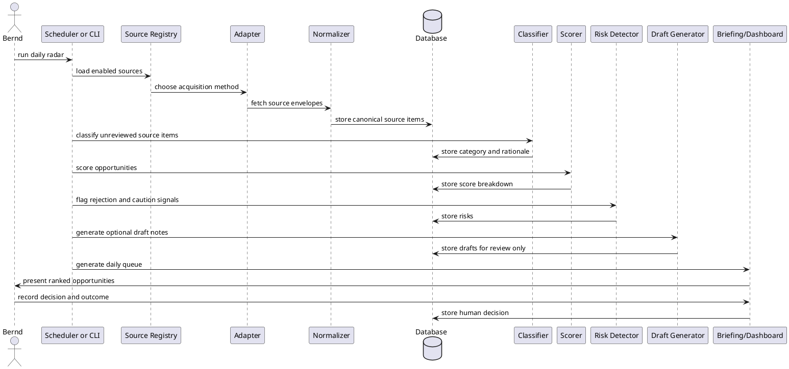

# Architecture

Last updated: 2026-05-13

## Purpose

Reddit Opportunity Radar monitors selected public sources, with Reddit as the first source family,
finds business opportunities that fit Bernd's consulting profile, ranks them for review, and records
outcomes so the system can improve over time.

The system is an intelligence and decision-support tool. It is not an outreach bot.

## Existing Project Inputs

This architecture is based on the current repository contents:

- `README.md`: product overview, target user, scoring ideas, source list, and guardrails.
- `Docs/adaptive_learning.md`: learning loop for outcomes, missed opportunities, source discovery, and prompt/rule evolution.
- `Docs/chatgpt_codex_review.md`: generated reports and review workflow.
- `Docs/source_acquisition.md`: source-agnostic acquisition design and research notes.
- `src/reddit_radar/`: early Python package with settings, collectors, pipeline, classifier, scorer, storage, briefing, and dashboard modules.

## Architecture Principles

- Keep Bernd in control of outreach.
- Separate collection, classification, scoring, risk detection, drafting, review, and learning.
- Start with a local-first MVP that can become deployable later.
- Prefer explicit rules and saved examples before opaque automation.
- Store enough history to explain recommendations and improve outcomes.
- Make source, scoring, prompt, and policy changes reviewable.
- Avoid collecting or retaining unnecessary personal data.
- Keep acquisition independent from assessment so source methods can change without rewriting the
  opportunity engine.

## Accepted Initial Shape

The accepted MVP is a local-first Python modular monolith:

- A local scheduled or manually run acquisition pipeline.
- Source definitions that separate what to monitor from how to acquire it.
- Swappable acquisition adapters for Reddit RSS, Reddit API, generic RSS, Hacker News, Lobsters,
  GitHub Discussions, and manual imports.
- SQLite as the first database.
- SQLModel for structured persistence.
- Deterministic classification and scoring first, with optional LLM support later.
- Streamlit as the first review dashboard.
- Remote opportunities before local Los Angeles lead discovery.
- An initial remote expected-value threshold around 200 USD per pursuit hour.
- Minimal Reddit author metadata unless a stronger scoring need appears.
- Markdown reports for ChatGPT, Codex, and future OpenClaw review.
- FastAPI and OpenClaw tools added after the core daily queue proves useful.

This keeps the first version small while preserving clean boundaries for later API and automation work.

## System Context



## Component Model



## Processing Flow



## Data Model

The current model layer already includes:

- `RedditItem`: raw collected Reddit source item.
- `OpportunityAssessment`: classified and scored opportunity.
- `MissedOpportunity`: manually supplied missed lead.
- `SourceCandidate`: possible new source to evaluate.
- `LearningEvent`: record of important scoring, source, or prompt changes.

Recommended additions for the MVP:

- `SourceDefinition`: configured source, acquisition method, limits, and policy state.
- `SourceItem`: normalized item shared by Reddit, RSS, Hacker News, Lobsters, GitHub, and manual
  imports.
- `SourceCursor`: source-level cursor, last fetch timestamp, failure count, and backoff state.
- `HumanDecision`: decision labels such as ignored, saved, replied, applied, follow-up, converted, rejected, false positive, false negative.
- `RiskFlag`: normalized risk evidence instead of storing only text.
- `ScoreBreakdown`: structured scoring factors and weights.
- `PromptVersion`: prompt and rubric version history when LLM use begins.
- `ReviewBriefing`: generated daily and weekly briefing metadata.

## Runtime Workflows

### Daily Collection and Review

1. Read enabled source definitions.
2. Select the configured acquisition adapter for each source.
3. Collect recent source items within source-specific limits.
4. Normalize each item into the canonical source item shape.
5. Deduplicate by platform, source, external ID, canonical URL, or content hash.
6. Classify and score new items.
7. Generate risk flags and draft review notes.
8. Produce a daily briefing and dashboard queue.
9. Record Bernd's decisions.

The current operational rehearsal command is:

```shell
make dry-run
```

It reads fixture Reddit items, runs the same assessment and storage path used by the live collector
boundary, and deduplicates repeated items by Reddit item ID.

### Source-Agnostic Acquisition

Source acquisition is a separate layer from opportunity assessment. A source definition says what to
monitor, while an adapter says how to fetch it.

Recommended first source methods:

- `manual_import`: always available for misses, examples, and curated leads.
- `rss_feed`: generic RSS for Reddit RSS, Lobsters, newsletters, blogs, and alert feeds.
- `hacker_news_api`: official Hacker News API for jobs, Ask HN, Show HN, and relevant stories.
- `github_discussions_api`: selected repositories and categories through GitHub GraphQL.
- `reddit_api_praw`: official Reddit API path after approval and credentials.

`reddit_json_endpoint` should remain disabled or marked `needs_review` until a later policy decision
approves it. It may be technically convenient, but it should not become an implicit workaround for
missing Reddit API approval.

When Reddit API credentials arrive, the switch should happen by changing source definitions from an
RSS adapter to the PRAW adapter, then running both in a small shadow test. The classifier, scorer,
store, dashboard, briefing, and learning loop should not need to change.

### Missed Opportunity Review

1. Bernd adds a missed opportunity manually.
2. The system records why it was missed.
3. The weekly report groups missed opportunities by cause.
4. Approved changes become learning events and regression examples.

### Weekly Learning Review

1. Summarize source quality, false positives, false negatives, and outcomes.
2. Recommend source, scoring, risk, and prompt changes.
3. Bernd approves or rejects recommendations.
4. Approved changes are recorded and tested against saved examples.

## Deployment Path

### Phase 1: Local MVP

- SQLite database.
- CLI or Makefile tasks.
- Streamlit dashboard.
- Rule-based classifier and scorer.
- Markdown reports.
- Source registry and swappable acquisition adapters.

### Phase 2: Stronger Review Loop

- Regression examples for classification and risk.
- Structured score breakdowns.
- Human decision and outcome tracking.
- Weekly learning report.

### Phase 3: API and Tooling

- FastAPI read/write endpoints.
- OpenClaw-compatible tools.
- Optional background worker.
- Optional Postgres migration.

### Phase 4: Hosted or Shared Operation

- Deployment configuration.
- Postgres.
- Scheduler.
- Authentication if anyone beyond Bernd uses it.
- Monitoring and retention policy.

## Security, Privacy, and Ethics

- Store secrets only in `.env` or a secret manager, never in the repository.
- Treat Reddit API access as gated until credentials and approval are available.
- Treat Reddit RSS as a low-volume interim path, not an unrestricted scraping channel.
- Avoid storing more Reddit author data than needed.
- Keep source URLs for auditability.
- Keep outreach drafts internal until approved.
- Do not auto-DM, auto-apply, mass-post, or evade Reddit rules.
- Disable sources that return repeated policy, permission, or rate-limit failures.
- Keep user-visible explanations for scoring and rejection decisions.

## Architecture Decision Records

ADRs live in `Docs/adr/`.

Current records:

- `0001-record-architecture-decisions.md`
- `0002-human-approval-for-outreach.md`
- `0003-start-as-python-modular-monolith.md`
- `0004-use-sqlite-for-mvp.md`
- `0005-human-approved-learning-loop.md`
- `0006-phase-one-mvp-defaults.md`
- `0007-source-agnostic-acquisition.md`

## Accepted Phase 1 Defaults

The architecture interview resolved these defaults:

1. Local-first MVP.
2. Streamlit first.
3. Rules and regression examples before LLM classification.
4. Remote opportunities before local Los Angeles lead discovery.
5. Initial remote expected-value threshold around 200 USD per pursuit hour.
6. Minimal Reddit author metadata.
7. OpenAI and Ollama can both be supported later, but only one provider should be active at a time.
8. OpenClaw tools come after the dashboard and daily queue prove useful.
