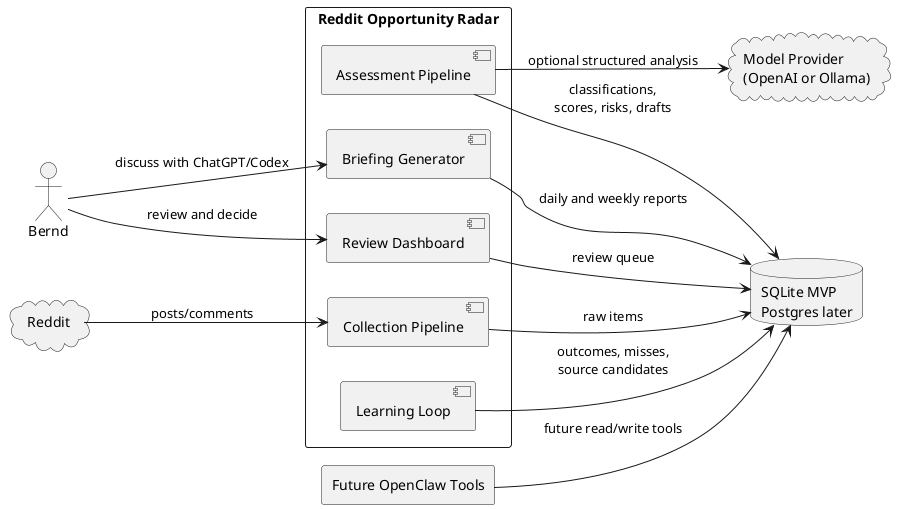
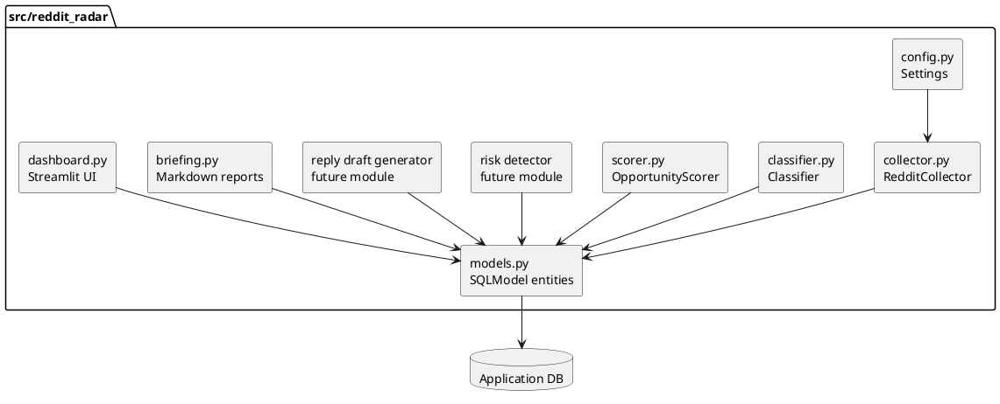
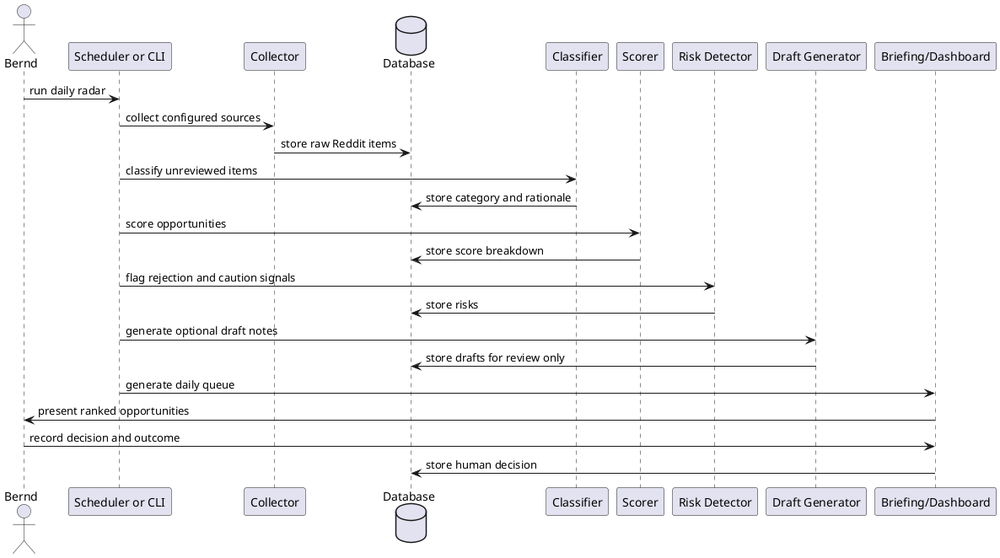

# Architecture

Last updated: 2026-05-11

## Purpose

Reddit Opportunity Radar monitors selected Reddit sources, finds business opportunities that fit Bernd's consulting profile, ranks them for review, and records outcomes so the system can improve over time.

The system is an intelligence and decision-support tool. It is not an outreach bot.

## Existing Project Inputs

This architecture is based on the current repository contents:

- `README.md`: product overview, target user, scoring ideas, source list, and guardrails.
- `Docs/adaptive_learning.md`: learning loop for outcomes, missed opportunities, source discovery, and prompt/rule evolution.
- `Docs/chatgpt_codex_review.md`: generated reports and review workflow.
- `src/reddit_radar/`: early Python package with settings, SQLModel entities, and placeholder collector/classifier/scorer/dashboard modules.

## Architecture Principles

- Keep Bernd in control of outreach.
- Separate collection, classification, scoring, risk detection, drafting, review, and learning.
- Start with a local-first MVP that can become deployable later.
- Prefer explicit rules and saved examples before opaque automation.
- Store enough history to explain recommendations and improve outcomes.
- Make source, scoring, prompt, and policy changes reviewable.
- Avoid collecting or retaining unnecessary personal data.

## Recommended Initial Shape

The recommended MVP is a Python modular monolith:

- A local scheduled or manually run collection pipeline.
- SQLite as the first database.
- SQLModel for structured persistence.
- Deterministic classification and scoring first, with optional LLM support later.
- Streamlit as the first review dashboard.
- Markdown reports for ChatGPT, Codex, and future OpenClaw review.
- FastAPI and OpenClaw tools added after the core daily queue proves useful.

This keeps the first version small while preserving clean boundaries for later API and automation work.

## System Context

## Component Model

## Processing Flow

## Data Model

The current model layer already includes:

- `RedditItem`: raw collected Reddit source item.
- `OpportunityAssessment`: classified and scored opportunity.
- `MissedOpportunity`: manually supplied missed lead.
- `SourceCandidate`: possible new source to evaluate.
- `LearningEvent`: record of important scoring, source, or prompt changes.

Recommended additions for the MVP:

- `HumanDecision`: decision labels such as ignored, saved, replied, applied, follow-up, converted, rejected, false positive, false negative.
- `RiskFlag`: normalized risk evidence instead of storing only text.
- `ScoreBreakdown`: structured scoring factors and weights.
- `PromptVersion`: prompt and rubric version history when LLM use begins.
- `ReviewBriefing`: generated daily and weekly briefing metadata.

## Runtime Workflows

### Daily Collection and Review

1. Read configured subreddits and search queries.
2. Collect recent posts and comments within rate limits.
3. Deduplicate by Reddit item ID.
4. Classify and score new items.
5. Generate risk flags and draft review notes.
6. Produce a daily briefing and dashboard queue.
7. Record Bernd's decisions.

### Missed Opportunity Review

1. Bernd adds a missed opportunity manually.
2. The system records why it was missed.
3. The weekly report groups missed opportunities by cause.
4. Approved changes become learning events and regression examples.

### Weekly Learning Review

1. Summarize source quality, false positives, false negatives, and outcomes.
2. Recommend source, scoring, risk, and prompt changes.
3. Bernd approves or rejects recommendations.
4. Approved changes are recorded and tested against saved examples.

## Deployment Path

### Phase 1: Local MVP

- SQLite database.
- CLI or Makefile tasks.
- Streamlit dashboard.
- Rule-based classifier and scorer.
- Markdown reports.

### Phase 2: Stronger Review Loop

- Regression examples for classification and risk.
- Structured score breakdowns.
- Human decision and outcome tracking.
- Weekly learning report.

### Phase 3: API and Tooling

- FastAPI read/write endpoints.
- OpenClaw-compatible tools.
- Optional background worker.
- Optional Postgres migration.

### Phase 4: Hosted or Shared Operation

- Deployment configuration.
- Postgres.
- Scheduler.
- Authentication if anyone beyond Bernd uses it.
- Monitoring and retention policy.

## Security, Privacy, and Ethics

- Store secrets only in `.env` or a secret manager, never in the repository.
- Avoid storing more Reddit author data than needed.
- Keep source URLs for auditability.
- Keep outreach drafts internal until approved.
- Do not auto-DM, auto-apply, mass-post, or evade Reddit rules.
- Keep user-visible explanations for scoring and rejection decisions.

## Architecture Decision Records

ADRs live in `Docs/adr/`.

Current records:

- `0001-record-architecture-decisions.md`
- `0002-human-approval-for-outreach.md`
- `0003-start-as-python-modular-monolith.md`
- `0004-use-sqlite-for-mvp.md`
- `0005-human-approved-learning-loop.md`

## Decisions That Need Bernd

The following choices should be discussed before implementation moves beyond placeholders:

1. Local-first MVP or hosted-first system.
2. Streamlit first or FastAPI plus separate web UI first.
3. Rules-first classifier or LLM-first classifier.
4. Remote opportunities first or local client leads first.
5. Minimum expected value threshold for remote pursuit.
6. Minimal author metadata policy.
7. First active model provider for draft generation.
8. Timing of OpenClaw tool design.

